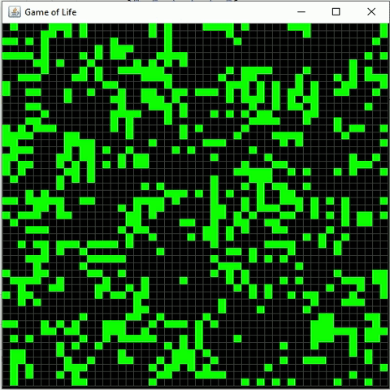

## Game of Life
This project implements Conway's Game of Life, a cellular automaton devised by the British mathematician John Horton Conway in 1970. The game is a zero-player game, meaning that its evolution is determined by its initial state, requiring no further input. One interacts with the Game of Life by creating an initial configuration and observing how it evolves.



### Implementation
The project consists of the following Java classes:

- **Board.java**: Defines the game board and its operations, including initialization, computing the next state, and determining the number of neighbors for each cell.
- **BoardTest.java**: Contains JUnit tests for validating the behavior of the Board class.
- **GameOfLifeVisualizer.java**: Provides a graphical user interface for visualizing the Game of Life simulation.
- **Main.java**: Contains the main method to run the visualizer.

### Usage
To run the simulation, execute the `Main` class. You can specify the initial state of the board as random or provide a custom initial state. The simulation will continue indefinitely, updating the board according to the rules of the Game of Life.

### Dependencies
The project uses Java Swing for the graphical user interface and JUnit for unit testing.

### Running the Application

**Compile Your Java Files**: Ensure that all your Java files are compiled into bytecode (.class files). You can do this using the `javac` command. For example:

```bash
javac Main.java
```
**Run Your Application**: Once your Java files are compiled, you can run your application using the `java` command followed by the name of the class containing the `main` method (without the .`java` extension). For example:

```bash
java Main
```